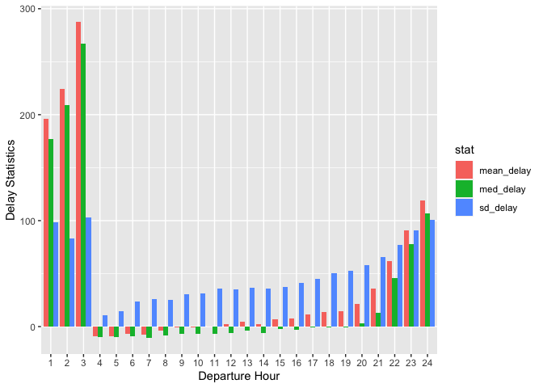
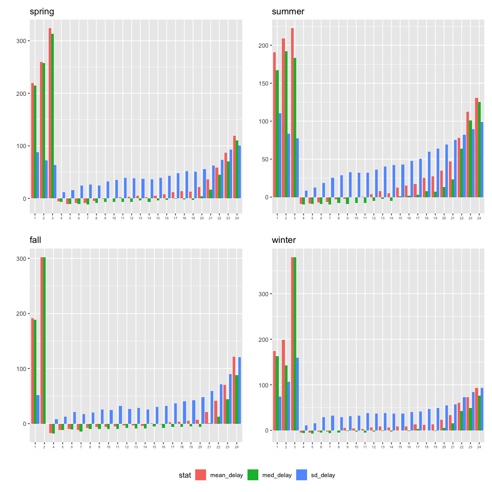
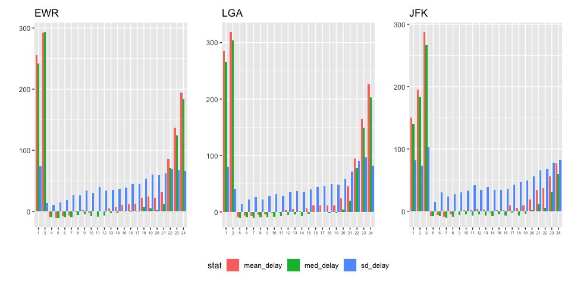

**STAT-433 HW2**
================
Xiaoyang Wang
2022-10-10

``` r
library(dplyr)
library(nycflights13)
library(ggplot2)
library(tidyr)
```

# Introduction

In order to avoid delays as much as possible, one should fly during 4-8
in general. Considering seasons, one should fly during 4-8 in Spring,
4-9 in Summer, 4-10 and 12-14 in Fall and 4-10 in Winter. In terms of
departure airports, one should fly during 4-8 at EWR, 5-11 at LGA, and 5
or 7 at JFK.

# 1 Overall

We measure delays by arrival delays as they are what most people truly
care about. The plot of departure hour against average delays is as
follows:

``` r
new_flights = flights %>%
  drop_na() %>% 
  mutate(dep_hour = ifelse(dep_time %/% 100 > 0, dep_time %/% 100, 24)) %>% 
  group_by(dep_hour)

delay = new_flights %>% 
  summarise(mean_delay = mean(arr_delay, na.rm=TRUE),
            med_delay = median(arr_delay, na.rm=TRUE),
            sd_delay = sd(arr_delay, na.rm=TRUE))
delay %>% 
  gather(stat, value, mean_delay:sd_delay) %>% 
  ggplot(aes(x = factor(dep_hour), y = value, fill = stat)) + 
  geom_bar(stat = "identity", position = 'dodge') + 
  ylab('Delay Statistics') +
  xlab('Departure Hour') 
```

<!-- -->

From the plot, we can see that *from 4 to 10* the **mean delays** are
negative; *from 4 to 19*, the **median delays** are negative; *from 4 to
8*, the **standard deviation delays** are relatively small.
Consequently, 4-8 may be the ideal time for one to fly if one wants to
avoid delays as much as possible.

# 2 Season

According to Google, I set March to May as Spring, June to August as
Summer, September to November as Fall and the rest as Winter.

``` r
new_flights_2 = new_flights %>% 
  mutate(season = ifelse(month == 12, 1, month %/% 3 + 1)) %>% 
  group_by(dep_hour)

season = c("winter", "spring", "summer", "fall")
for (i in 1:4){
  assign(paste0("delay_", season[i]),
         new_flights_2 %>% 
           filter(season == i) %>% 
           summarise(mean_delay = mean(arr_delay, na.rm=TRUE),
                     med_delay = median(arr_delay, na.rm=TRUE),
                     sd_delay = sd(arr_delay, na.rm=TRUE)) %>% 
           gather(stat, value, mean_delay:sd_delay) %>% 
           ggplot(aes(x = factor(dep_hour), y = value, fill = stat)) + 
           geom_bar(stat = "identity", position = 'dodge') + 
           ggtitle(season[i]) + 
           xlab("") + 
           ylab("") + 
           theme(axis.text.x=element_text(size=5))
           )
}

library(patchwork)

delay_spring + delay_summer + delay_fall + delay_winter +
  plot_layout(guides = "collect") &
  theme(legend.position='bottom')
```

<!-- -->

From the above plot, we can see that for **Spring**, the ideal time is
still 4-8; for **Summer**, the ideal time may be 4-9; for **Fall**, the
ideal time change to 4-10 and 12-14; for **Winter**, the ideal time turn
out to be 4-10.

# 3 Airport

Here I only consider the departure airports.

``` r
airport = unique(flights$origin)
for (i in 1:3){
  assign(paste0("delay_", airport[i]),
         new_flights_2 %>% 
           filter(origin == airport[i]) %>% 
           summarise(mean_delay = mean(arr_delay, na.rm=TRUE),
                     med_delay = median(arr_delay, na.rm=TRUE),
                     sd_delay = sd(arr_delay, na.rm=TRUE)) %>% 
           gather(stat, value, mean_delay:sd_delay) %>% 
           ggplot(aes(x = factor(dep_hour), y = value, fill = stat)) + 
           geom_bar(stat = "identity", position = 'dodge') + 
           ggtitle(airport[i]) + 
           xlab("") + 
           ylab("") + 
           theme(axis.text.x=element_text(size=5))
           )
}

library(patchwork)

delay_EWR + delay_LGA + delay_JFK +
  plot_layout(guides = "collect") &
  theme(legend.position='bottom')
```

<!-- -->

From the plot, it is clearly that for **EWR**, the ideal time is still
4-8; for **LGA**, it changes to 5-11; and for **JFK**, only 5 and 7 is
satisfying.

# 4 Airline

``` r
delay_mean = new_flights_2 %>% 
  group_by(dep_hour, carrier) %>% 
  summarise(mean_delay = mean(arr_delay, na.rm=TRUE)) %>% 
  ggplot(aes(x = factor(dep_hour), y = mean_delay, col = factor(carrier))) + 
  geom_point() +
  ggtitle("Mean") + 
  xlab("") + 
  ylab("") + 
  theme(axis.text.x=element_text(size=5))

delay_med = new_flights_2 %>% 
  group_by(dep_hour, carrier) %>% 
  summarise(med_delay = median(arr_delay, na.rm=TRUE)) %>% 
  ggplot(aes(x = factor(dep_hour), y = med_delay, col = factor(carrier))) + 
  geom_point() +
  ggtitle("Median") + 
  xlab("") + 
  ylab("") + 
  theme(axis.text.x=element_text(size=5))

delay_sd = new_flights_2 %>% 
  group_by(dep_hour, carrier) %>% 
  summarise(sd_delay = sd(arr_delay, na.rm=TRUE)) %>% 
  ggplot(aes(x = factor(dep_hour), y = sd_delay, col = factor(carrier))) + 
  geom_point() +
  ggtitle("Standard Deviation") + 
  xlab("") + 
  ylab("") + 
  theme(axis.text.x=element_text(size=5))


library(patchwork)

delay_mean + delay_med + delay_sd +
  plot_layout(guides = "collect") &
  theme(legend.position='bottom')
```

<!-- -->

As there are so many airlines, it is hard to tell. But obviously, the
choice varies between different airlines.
