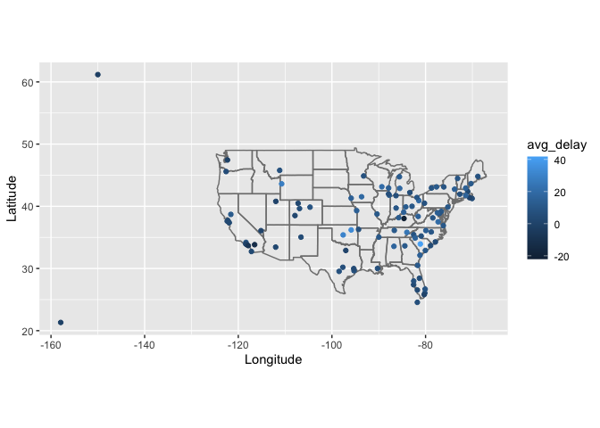
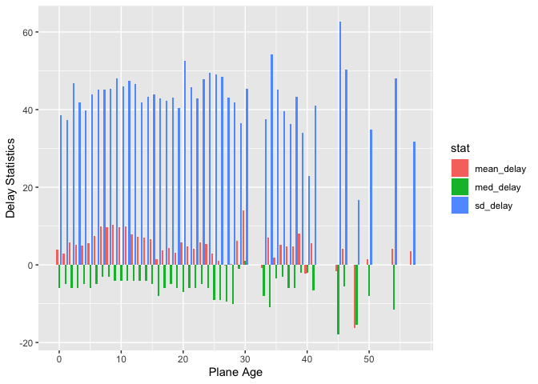
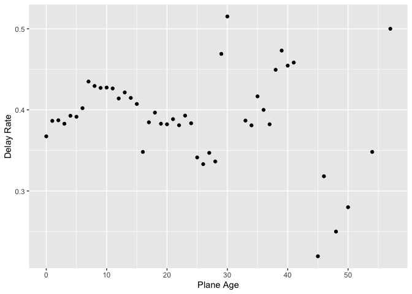

**STAT-433 HW3**
================
Xiaoyang Wang
2022-10-17

``` r
library(dplyr)
library(nycflights13)
library(ggplot2)
library(tidyr)
```

# 1 Compute the average delay by destination, then join on the airports data frame so you can show the spatial distribution of delays.

``` r
flights %>%
  group_by(dest) %>% 
  summarise(avg_delay = mean(arr_delay, na.rm = T)) %>% 
  inner_join(airports, by = c(dest = "faa")) %>% 
  ggplot(aes(lon, lat)) +
  borders("state") +
  geom_point(aes(col = avg_delay)) +
  coord_quickmap() + 
  xlab("Longitude") +
  ylab("Latitude")
```

<!-- -->

# 2 Add the location of the origin and destination (i.e. the lat and lon) to flights.

``` r
airports_loc = airports %>% select(faa, lat, lon)

flights %>% 
  left_join(airports_loc,
            by = c(origin = "faa")) %>% 
  left_join(airports_loc,
            by = c(dest = "faa"),
            suffix = c(".origin", ".destination")) %>% 
  select(origin, dest, lat.origin:lon.destination)
```

    ## # A tibble: 336,776 × 6
    ##    origin dest  lat.origin lon.origin lat.destination lon.destination
    ##    <chr>  <chr>      <dbl>      <dbl>           <dbl>           <dbl>
    ##  1 EWR    IAH         40.7      -74.2            30.0           -95.3
    ##  2 LGA    IAH         40.8      -73.9            30.0           -95.3
    ##  3 JFK    MIA         40.6      -73.8            25.8           -80.3
    ##  4 JFK    BQN         40.6      -73.8            NA              NA  
    ##  5 LGA    ATL         40.8      -73.9            33.6           -84.4
    ##  6 EWR    ORD         40.7      -74.2            42.0           -87.9
    ##  7 EWR    FLL         40.7      -74.2            26.1           -80.2
    ##  8 LGA    IAD         40.8      -73.9            38.9           -77.5
    ##  9 JFK    MCO         40.6      -73.8            28.4           -81.3
    ## 10 LGA    ORD         40.8      -73.9            42.0           -87.9
    ## # … with 336,766 more rows

# 3 Is there a relationship between the age of a plane and its delays?

Still, we take arrival delays as the measurement of delays.

``` r
planes_year = planes %>% select(tailnum, year)

flights %>% 
  inner_join(planes_year,
             by = c(tailnum = "tailnum"),
             suffix = c("", ".plane")) %>% 
  mutate(age = year - year.plane) %>% 
  drop_na() %>% 
  group_by(age) %>% 
  summarise(mean_delay = mean(arr_delay, na.rm = T),
            med_delay = median(arr_delay, na.rm = T),
            sd_delay = sd(arr_delay, na.rm = T)) %>% 
  gather(stat, value, mean_delay:sd_delay) %>% 
  ggplot(aes(x = age, y = value, fill = stat)) +
  geom_bar(stat = "identity", position = 'dodge') + 
  ylab('Delay Statistics') +
  scale_x_continuous("Plane Age", breaks = seq(0, 57,
                                               by = 10))
```

<!-- -->

From the plot we can see that:

-   The mean delays generally increase as the age of planes increase for
    the planes whose ages are less than 10 years;

-   For planes age 10-15 years, the mean delays decrease as the age
    increase;

-   Situation for planes age 15-25 is the same as that of planes age
    0-15;

-   For planes age 25 - 30, the mean delays increase as age increase;

-   For the rest planes, mean delays generally decrease as the age of
    planes increase.

The standard variance and median delays seem meaningless here.

Moreover, let’s look at the delay rate:

``` r
flights %>% 
  inner_join(planes_year,
             by = c(tailnum = "tailnum"),
             suffix = c("", ".plane")) %>% 
  mutate(age = year - year.plane) %>% 
  drop_na() %>% 
  group_by(age) %>% 
  summarise(rate_delay = sum(arr_delay > 0) / n()) %>% 
  ggplot(aes(x = age, y = rate_delay)) +
  geom_point() + 
  ylab('Delay Rate') +
  scale_x_continuous("Plane Age", breaks = seq(0, 57,
                                               by = 10))
```

<!-- -->

From the plot, we can see that the delay rate has approximate situation
with the mean delays for the planes age less than 30 years. For the rest
planes, there is no obvious pattern between the delay rate and the age.
